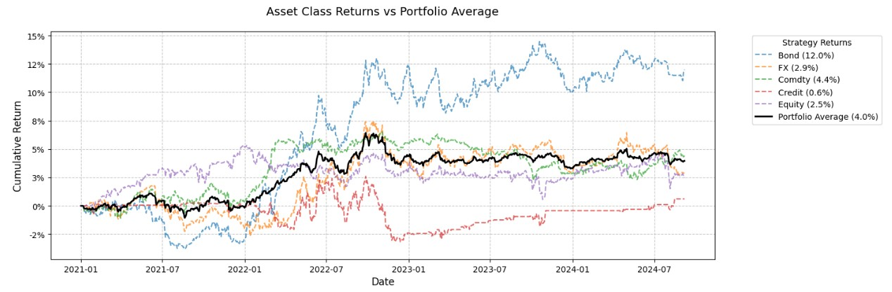
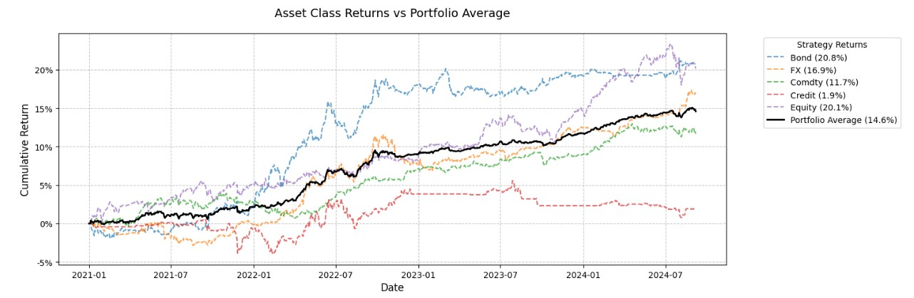

# A Trading Strategy using Liquid Futures: can we improve classic Momentum strategies by using ML and AI
## Multi-Model Financial Time Series Classification
Capstone Project Submission for Imperial College Certificate in Machine Learning and AI 2024 

## Project Overview
A  machine learning project that combines multiple models (Random Forest, XGBoost, and Transformer) to predict trading signals across various liquid futures markets and credit derivatives swaps (CDS). The strategy encompasses multiple asset classes and compares performance against traditional CTA momentum strategies.

## NON-TECHNICAL EXPLANATION OF YOUR PROJECT
This project develops AI systems that analyze patterns in financial market data to predict trading signals (Buy, Hold, or Sell). We compare three different approaches: a deep learning model (SimpleTransformerClassifier) that learns complex patterns like humans reading charts, and two traditional machine learning models (Random Forest and XGBoost) that excel at combining multiple simple decision rules. This combination allows us to leverage different strengths: the transformer's ability to understand sequences, Random Forest's robustness, and XGBoost's ability to learn from mistakes progressively.

## DATA
The model processes financial time series data organized into sequential windows. Each sequence contains multiple features that capture market behavior over time. The data is preprocessed using:
- Standardization to normalize the scale of different features
- Sliding window approach to create sequences for the transformer model
- Standard scaling for numerical features and one-hot encoding for categorical features in RF/XGBoost
- Proper time series splits to prevent future data leakage in all models

## MODEL 
We implemented three different models, each with unique strengths:

1. Random Forest:
   - Ensemble of 200 decision trees
   - Excellent at handling non-linear relationships
   - Built-in feature importance assessment
   - Robust to outliers and noise

2. XGBoost:
   - Gradient boosting implementation
   - Progressive learning from mistakes
   - Handles missing values automatically
   - Strong regularization capabilities
   - 
3. Random Forest + XGBoost Mix 50-50 classification
 
4. SimpleTransformerClassifier:
   - Neural network designed for sequence processing
   - 2-head attention mechanism for pattern recognition
   - Global average pooling and classification head
   - Balances complexity with computational efficiency

## HYPERPARAMETER OPTIMSATION
Each model underwent specific hyperparameter optimization:

Random Forest:
- n_estimators: [100, 200]
- max_depth: [5, 10, 20]
- min_samples_split: [2, 5, 10]
- min_samples_leaf: [1, 2, 4]
- Best config: max_depth=10, n_estimators=200, min_samples_leaf=4

XGBoost:
- n_estimators: [100, 200]
- max_depth: [3, 6, 9]
- learning_rate: [0.01, 0.05]
- subsample: [0.8, 0.9]
- Best config: max_depth=3, learning_rate=0.01, n_estimators=200

SimpleTransformerClassifier:
- Learning Rate: 0.00001 to 0.00005
- Sequence Length: 20 to 90
- Batch Size: 12, 32, 64
- Best config: lr=0.00005, seq_length=60, batch_size=64

  
## RESULTS
Performance comparison across models:

Random Forest:
- Accuracy: ~39%
- Excellent interpretability
- Robust performance across different market conditions

XGBoost:
- Accuracy: ~39%
- Competitive performance
- Better handling of market regime changes

Combined  Random Forest + XGBoost
- Accuracy: ~39%
- Competitive performance
- Better handling mixing the 2 approaches 50-50 for the prediction

SimpleTransformerClassifier:
- Best Accuracy: 38.847%
- Minimum Loss: 1.08537
- Strong performance on sequential patterns
  
Achieving 39% accuracy in a three-class financial prediction problem (Buy/Sell/Hold) is actually quite notable when properly contextualized. While this might seem only slightly better than the default probability of 33.33% (random chance with equal class distribution), in financial markets even a small edge can translate into significant profits when consistently applied, in this case over 40 instruments. This is particularly true because financial markets are highly efficient and notoriously difficult to predict - they incorporate vast amounts of information and are influenced by countless variables, making any consistent advantage over random chance valuable. The fact that all three sophisticated approaches ( RF + XGBoost, and AI Transformer) achieve similar classification accuracy around 39% suggests this might represent a meaningful signal rather than just statistical noise. Moreover, when this slight predictive advantage is combined with proper risk management and portfolio optimization it can lead to substantial improvements in risk-adjusted returns as shown below in the Portfolio Performance section.

### Equal-Weighted Portfolio Performance: Model Comparison (01/01/21 to 14/09/24)

| Metric | Simple Momentum | RF + XGBoost | AI Transformer |
|--------|-----------------|--------------|----------------|
| Contract | EW Portfolio | Portfolio Average | Portfolio Average |
| Annualized_Return | 1.03% | 1.02% | 3.64% |
| Annualized_Volatility | 2.49% | 1.90% | 1.59% |
| Sharpe_Ratio | 0.41 | 0.54 | 2.29 |
| Max_Drawdown | -8.87% | -3.14% | -1.10% |
| Skewness | -0.40 | -0.63 | -0.29 |
| Kurtosis | 3.03 | 4.58 | 4.73 |
| Total_Return | 3.97% | 3.96% | 14.59% |
| Number_of_Days | 961.0 | 961.0 | 961.0 |

Key Insights:
1. Performance Comparison:
   - AI Transformer significantly outperforms both Simple Momentum and RF + XGBoost strategies
   - While Simple Momentum and RF + XGBoost show similar returns (~1%), AI Transformer achieves 3.64%
   - Total return for AI Transformer (14.59%) is nearly 4x higher than other approaches

2. Risk Management:
   - AI Transformer shows the lowest volatility (1.59%)
   - Maximum drawdown improves dramatically from Simple Momentum (-8.87%) to AI Transformer (-1.10%)
   - Risk-adjusted returns (Sharpe Ratio) are significantly better with AI Transformer (2.29)

3. Statistical Properties:
   - All strategies show negative skewness, with RF + XGBoost showing the most negative (-0.63)
   - ML-based approaches (RF + XGBoost and AI Transformer) show higher kurtosis
   - Performance measured over the same 961-day period for all strategies

4. Model Evolution:
   - Clear improvement in risk-adjusted performance from traditional to advanced ML approaches
   - AI Transformer achieves better returns while maintaining lower risk metrics
   - Machine learning approaches (both traditional and deep learning) show better drawdown control

*Figure 1: Profitability of RF + XGBoost Model, test 01/01/21 to 14/09/24*

*Figure 1: Profitability of RF + XGBoost Model, test 01/01/21 to 14/09/24*

## CONTACT DETAILS
For further information about this project or collaboration opportunities:
- GitHub: [https://github.com/claudio2323/Momentum-ML-Model]
- Email: [claudio.ferrarese@gmail.com]
- Linkedin: [https://www.linkedin.com/in/claudio-ferrarese-cfa/]

